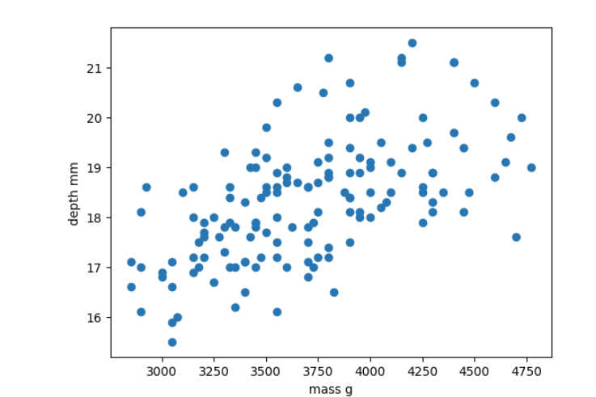
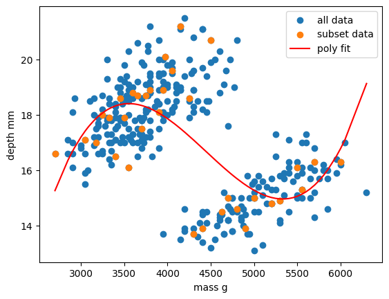

# Supervised learning

Classical machine learning is often divided into two categories – supervised and unsupervised learning.

For the case of supervised learning we act as a "supervisor" or "teacher" for our ML algorithms by providing the algorithm with "labelled data" that contains example answers of what we wish the algorithm to achieve.

For instance, if we wish to train our algorithm to distinguish between images of cats and dogs, we would provide our algorithm with images that have already been labelled as "cat" or "dog" so that it can learn from these examples. If we wished to train our algorithm to predict house prices over time we would provide our algorithm with example data of datetime values that are "labelled" with house prices.

Supervised learning is split up into two further categories: classification and regression. For classification the labelled data is discrete, such as the "cat" or "dog" example, whereas for regression the labelled data is continuous, such as the house price example.

In this episode we will explore how we can use regression to build a "model" that can be used to make predictions.


# Regression

Regression is a statistical technique that relates a dependent variable (a label in ML terms) to one or more independent variables (features in ML terms). A regression model attempts to describe this relation by fitting the data as closely as possible according to mathematical criteria. This model can then be used to predict new labelled values by inputting the independent variables into it. For example, if we create a house price model we can then feed in any datetime value we wish, and get a new house price value prediction.

Regression can be as simple as drawing a "line of best fit" through data points, known as linear regression, or more complex models such as polynomial regression, and is used routinely around the world in both industry and research. You may have already used regression in the past without knowing that it is also considered a machine learning technique!


### Linear regression using Scikit-Learn

We've had a lot of theory so time to start some actual coding!

#### The penguins dataset

We're going to be using the penguins dataset of Allison Horst, published [here](https://github.com/allisonhorst/palmerpenguins), The dataset contains 344 size measurements for three penguin species (Chinstrap, Gentoo and Adélie) observed on three islands in the Palmer Archipelago, Antarctica.


The physical attributes measured are flipper length, beak length, beak width, body mass, and sex. This picture shows exactly what bill length and depth correspond to.


The penguin dataset is available through the Python plotting library [Seaborn](https://seaborn.pydata.org/).

Let's start by loading in and examining the penguin dataset, which containing a few hundred samples and a number of features and labels.

```python
import seaborn as sns

dataset = sns.load_dataset("penguins")
dataset.head()
```

We can see that we have seven columns in total: 4 continuous (numerical) columns named `bill_length_mm`, `bill_depth_mm`, `flipper_length_mm`, and `body_mass_g`; and 3 discrete (categorical) columns named `species`, `island`, and `sex`. We can also see from a quick inspection of the first 5 samples that we have some missing data in the form of `NaN` values. Missing data is a fairly common occurrence in real-life data, so let's go ahead and remove any rows that contain `NaN` values:

```python
dataset.dropna(inplace=True)
dataset.head()
```

In this scenario we will train a linear regression model using `body_mass_g` as our feature data and `bill_depth_mm` as our label data. We will train our model on a subset of the data by slicing the first 146 samples of our cleaned data.

In machine learning we often train our models on a subset of data, for reasons we will explain later in this lesson, so let us extract a subset of data to work on by slicing the first 146 samples of our cleaned data and extracting our feature and label data:

```python
import matplotlib.pyplot as plt

dataset_1 = dataset[:146]

x_data = dataset_1["body_mass_g"]
y_data = dataset_1["bill_depth_mm"]

plt.scatter(x_data, y_data)
plt.xlabel("mass g")
plt.ylabel("depth mm")
plt.show()
```



In this regression example we will create a Linear Regression model that will try to predict `y` values based upon `x` values.

In machine learning terminology: we will use our `x` feature (variable) and `y` labels("answers") to train our Linear Regression model to predict `y` values when provided with `x` values.

The mathematical equation for a linear fit is `y = mx + c` where `y` is our label data, `x` is our input feature(s), `m` represents the gradient of the linear fit, and `c` represents the intercept with the y-axis.

A typical ML workflow is as following:

- Decide on a model to use model (also known as an estimator)
- Tweak your data into the required format for your model
- Define and train your model on the input data
- Predict some values using the trained model
- Check the accuracy of the prediction, and visualise the result

We have already decided to use a linear regression model, so we'll now pre-process our data into a format that Scikit-Learn can use.

```python
import numpy as np

# sklearn requires a 2D array, so lets reshape our 1D arrays from (N) to (N,).
x_data = np.array(x_data).reshape(-1, 1)
y_data = np.array(y_data).reshape(-1, 1)
```

Next we'll define a model, and train it on the pre-processed data. We'll also inspect the trained model parameters m and c:

```python
from sklearn.linear_model import LinearRegression

# Define our estimator/model
model = LinearRegression(fit_intercept=True)

# train our estimator/model using our data
lin_regress = model.fit(x_data,y_data)

# inspect the trained estimator/model parameters
m = lin_regress.coef_
c = lin_regress.intercept_
print("linear coefs=",m, c)
```

Now we can make predictions using our trained model, and calculate the Root Mean Squared Error (RMSE) of our predictions:

```python
import math
from sklearn.metrics import mean_squared_error

# Predict some values using our trained estimator/model.
# In this case we predict our input data to evaluate accuracy!
linear_data = lin_regress.predict(x_data)

# calculated a RMS error as a quality of fit metric
error = math.sqrt(mean_squared_error(y_data, linear_data))
print("linear error=",error)
```

Finally, we'll plot our input data, our linear fit, and our predictions:

```python
plt.scatter(x_data, y_data, label="input")
plt.plot(x_data, linear_data, "-", label="fit")
plt.plot(x_data, linear_data, "rx", label="predictions")
plt.xlabel("body_mass_g")
plt.ylabel("bill_depth_mm")
plt.legend()
plt.show()
```


Congratulations! We've now created our first machine-learning model of the lesson.

We can now make new predictions of `bill_depth_mm` for any `body_mass_g` values that we pass into our trained model: this is the real power of machine learning.

Let's practice!

~~~
# New body mass to predict
x = 3500
x_new = np.array(x).reshape(-1, 1)

pred_y = lin_regress.predict(x_new)   # shape (1,1)
y_pred_value = float(pred_y[0][0])

print(f"Prediction for body_mass_g = {x}: bill_depth_mm ≈ {y_pred_value:.2f}")
print(f"Interpretation: On the existing plot this would appear at the point ({x}, {y_pred_value:.2f}).")
~~~
{: .language-python}

> ## Exercise: Make more predictions
>
> Using the same fitted model (`lin_regress`) above (re‑run that cell first if needed):
> 1. Predict the bill depth for a penguin with a body mass of 2000 g.  
> 2. Predict the bill depth for a penguin with a body mass of 6000 g.  
> 3. Predict the bill depths for three masses at once: 3500 g, 4000 g, and 4500 g.  
>
> For each prediction, print the numeric result and a short sentence describing where the point would appear on the existing plot (e.g. “(2000, XX.XX)”).
>
> Hint: You only need to reshape your inputs to 2D (e.g. `np.array(2000).reshape(-1,1)` or `np.array([3500,4000,4500]).reshape(-1,1)`).
> > ## Solution
> > 
> > ~~~
> > # (1) Single prediction: 2000 g
> > x_2000 = np.array(2000).reshape(-1, 1)
> > pred_2000 = lin_regress.predict(x_2000)
> > print(f"Prediction for body_mass_g = 2000: bill_depth_mm ≈ {float(pred_2000[0][0]):.2f}")
> > print(f"Would appear at (2000, {float(pred_2000[0][0]):.2f}).")
> >
> > # (2) Single prediction: 6000 g
> > x_6000 = np.array(6000).reshape(-1, 1)
> > pred_6000 = lin_regress.predict(x_6000)
> > print(f"Prediction for body_mass_g = 6000: bill_depth_mm ≈ {float(pred_6000[0][0]):.2f}")
> > print(f"Would appear at (6000, {float(pred_6000[0][0]):.2f}).")
> >
> > # (3) Multiple predictions: 3500, 4000, 4500 g
> > multi_masses = np.array([3500, 4000, 4500]).reshape(-1, 1)
> > multi_preds = lin_regress.predict(multi_masses)
> > for mass, pred in zip(multi_masses.flatten(), multi_preds):
> >     val = float(pred[0])
> >     print(f"Prediction for body_mass_g = {mass}: bill_depth_mm ≈ {val:.2f}")
> >     print(f"Would appear at ({mass}, {val:.2f}).")
> > ~~~
> > {: .language-python}
> {: .solution}
{: .challenge}

### Exploring more of the data

Let's provide the model with all of the penguin samples and visually inspect how the linear regression model performs.

~~~
# Prepare the full cleaned dataset as (N, 1) arrays
x_data_all = np.array(dataset["body_mass_g"]).reshape(-1, 1)
y_data_all = np.array(dataset["bill_depth_mm"]).reshape(-1, 1)

# Predict with the same model (lin_regress) we trained on the 146-sample subset
y_predictions_all = lin_regress.predict(x_data_all)

# How well does the model fit on *all* the data?
error_all = math.sqrt(mean_squared_error(y_data_all, y_predictions_all))
print("linear error on all data =", error_all)

# Draw the fit as a straight line via two endpoints so it plots cleanly
x_line = np.array([x_data_all.min(), x_data_all.max()]).reshape(-1, 1)
y_line = lin_regress.predict(x_line)

plt.scatter(x_data_all, y_data_all, color="tab:blue", label="all data")
plt.scatter(x_data, y_data, color="tab:orange", marker="x", label="training data")
plt.plot(x_line, y_line, "r-", label="linear fit")
plt.xlabel("body_mass_g")
plt.ylabel("bill_depth_mm")
plt.legend()
plt.show()
~~~
{: .language-python}


Oh dear. It looks like our linear regression fits okay for our subset of the penguin data, and a few additional samples, but there appears to be a cluster of points that are poorly predicted by our model.

> ## This is a classic Machine Learning scenario known as over-fitting
> We have trained our model on a specific set of data, and our model has learnt to reproduce those specific answers at the expense of creating a more generally-applicable model.
> Over fitting is the ML equivalent of learning an exam papers mark scheme off by heart, rather than understanding and answering the questions.
{: .callout}

### Polynomial fit

Let's explore a different type of relationship.

Polynomial functions are non-linear functions that are commonly-used to model curvy relationships. Mathematically they have `N` degrees of freedom and they take the following form `y = a + bx + cx^2 + dx^3 ... + mx^N`. If we have a polynomial of degree `N=1` we once again return to a linear equation `y = a + bx` or as it is more commonly written `y = mx + c`.

We'll follow the same workflow from before:

- Decide on a model to use model (also known as an estimator)
- Tweak your data into the required format for your model
- Define and train your model on the input data
- Predict some values using the trained model
- Check the accuracy of the prediction, and visualise the result

Polynomial estimators in Scikit-Learn are built in two steps. First we pre-process our input data `x_data` into a polynomial representation using the `PolynomialFeatures` function. Then we can create our polynomial regressions using the `LinearRegression().fit()` function as before, but this time using the polynomial representation of our `x_data`.

```python
from sklearn.preprocessing import PolynomialFeatures

# Requires sorted data for ordered polynomial lines
dataset = dataset.sort_values("body_mass_g")
x_data = dataset["body_mass_g"]
y_data = dataset["bill_depth_mm"]
x_data = np.array(x_data).reshape(-1, 1)
y_data = np.array(y_data).reshape(-1, 1)

# create our training subset from every 10th sample
x_data_subset = x_data[::10]
y_data_subset = y_data[::10]

# create a polynomial representation of our training data
poly_features = PolynomialFeatures(degree=3)
x_poly = poly_features.fit_transform(x_data_subset)
```

> ## We convert a non-linear problem into a linear one
> By converting our input feature data into a polynomial representation we can now solve our non-linear problem using linear techniques. This is a common occurence in machine learning as linear problems are far easier computationally to solve. We can treat this as just another pre-processing step to manipulate our features into a ML-ready format.
{: .callout}

We are now ready to create and train our model using our polynomial feature data.

```python
# Define our estimator/model(s) and train our model
poly_regress = LinearRegression()
poly_regress.fit(x_poly,y_data_subset)
```

We can now make predictions using our full dataset. As we did for our training data, we need to quickly transform our full dataset into a polynomial expression. Then we can evaluate the RMSE of our predictions.

```python
# make predictions using all data, pre-process data too
x_poly_all = poly_features.fit_transform(x_data)
poly_data = poly_regress.predict(x_poly_all)

poly_error = math.sqrt(mean_squared_error(y_data, poly_data))
print("poly error=", poly_error)
```

Finally, let's visualise our model fit on our training data and full dataset.

```python
plt.scatter(x_data, y_data, label="all data")
plt.scatter(x_data_subset, y_data_subset, label="subset data")

plt.plot(x_data, poly_data, "r-", label="poly fit")
plt.xlabel("mass g")
plt.ylabel("depth mm")
plt.legend()
plt.show()
```



> ## Exercise: Vary your polynomial degree to try and improve fitting
> Adjust the `degree=2` input variable for the `PolynomialFeatures` function to change the degree of polynomial fit. Can you improve the RMSE of your model?
{: .challenge}

As we can see, this relationship is still overfitted to the training data.

In the next section we will explore a different type of model that can deal with this type of data more effectively.


